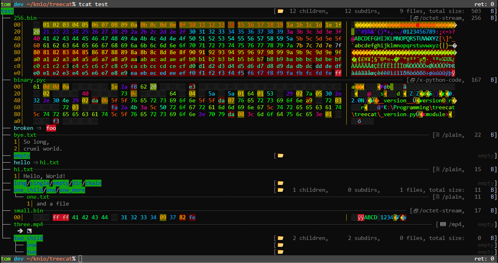

# treecat

Displays a tree view of files and their contents

## Installation

Recommended (latest release):
```sh
python3 -m pip install git+https://github.com/Knio/treecat.git
```


## Usage



```sh
tom@dev:~/knio/treecat$ tcat test
test                                     [📂  12 children,     12 subdirs,      9 files, total size:  503   B]
├── 256.bin┈┈┈┈┈┈┈┈┈┈┈┈┈┈┈┈┈┈┈┈┈┈┈┈┈┈┈┈┈┈┈┈┈┈┈┈┈┈┈┈┈┈┈┈┈┈┈┈┈┈┈┈┈┈┈┈┈┈┈┈┈┈┈┈┈┈┈┈┈┈┈ [🗗 /octet-stream,  256   B]
│   00│   00 01 02 03 04 05 06 07 08 09 0a 0b 0c 0d 0e 0f 10 11 12 13 │ ␀�������������������
│   14│   14 15 16 17 18 19 1a 1b 1c 1d 1e 1f 20 21 22 23 24 25 26 27 │ ������������ !"#$%&'
│   28│   28 29 2a 2b 2c 2d 2e 2f 30 31 32 33 34 35 36 37 38 39 3a 3b │ ()*+,-./0123456789:;
│   3c│   3c 3d 3e 3f 40 41 42 43 44 45 46 47 48 49 4a 4b 4c 4d 4e 4f │ <=>?@ABCDEFGHIJKLMNO
│   50│   50 51 52 53 54 55 56 57 58 59 5a 5b 5c 5d 5e 5f 60 61 62 63 │ PQRSTUVWXYZ[\]^_`abc
│   64│   64 65 66 67 68 69 6a 6b 6c 6d 6e 6f 70 71 72 73 74 75 76 77 │ defghijklmnopqrstuvw
│   78│   78 79 7a 7b 7c 7d 7e 7f 80 81 82 83 84 85 86 87 88 89 8a 8b │ xyz{|}~�������������
│   8c│   8c 8d 8e 8f 90 91 92 93 94 95 96 97 98 99 9a 9b 9c 9d 9e 9f │ ��������������������
│   a0│   a0 a1 a2 a3 a4 a5 a6 a7 a8 a9 aa ab ac ad ae af b0 b1 b2 b3 │ �¡¢£¤¥¦§¨©ª«¬�®¯°±²³
│   b4│   b4 b5 b6 b7 b8 b9 ba bb bc bd be bf c0 c1 c2 c3 c4 c5 c6 c7 │ ´µ¶·¸¹º»¼½¾¿ÀÁÂÃÄÅÆÇ
│   c8│   c8 c9 ca cb cc cd ce cf d0 d1 d2 d3 d4 d5 d6 d7 d8 d9 da db │ ÈÉÊËÌÍÎÏÐÑÒÓÔÕÖ×ØÙÚÛ
│   dc│   dc dd de df e0 e1 e2 e3 e4 e5 e6 e7 e8 e9 ea eb ec ed ee ef │ ÜÝÞßàáâãäåæçèéêëìíîï
│   f0│   f0 f1 f2 f3 f4 f5 f6 f7 f8 f9 fa fb fc fd fe ff             │ ðñòóôõö÷øùúûüýþÿ
├── binary.pyc┈┈┈┈┈┈┈┈┈┈┈┈┈┈┈┈┈┈┈┈┈┈┈┈┈┈┈┈┈┈┈┈┈┈┈┈┈┈┈┈┈┈┈┈┈┈┈┈┈┈┈┈┈┈┈┈┈┈┈┈┈┈┈┈┈┈┈ [🗗 /x-python-code,  167   B]
│   00│   61 0d 0d 0a 00 00 00 00 1e 2a f8 62 20 00 00 00 e3 00 00 00 │ a���␀␀␀␀�*øb ␀␀␀ã␀␀␀
│   14│   00 00 00 00 00 00 00 00 00 00 00 00 00 02 00 00 00 40 00 00 │ ␀␀␀␀␀␀␀␀␀␀␀␀␀�␀␀␀@␀␀
│   28│   00 73 0c 00 00 00 64 00 04 00 5a 00 5a 01 64 01 53 00 29 02 │ ␀s�␀␀␀d␀�␀Z␀Z�d�S␀)�
│   3c│   7a 05 30 2e 32 2e 30 4e 29 02 da 0b 5f 5f 76 65 72 73 69 6f │ z�0.2.0N)�Ú�__versio
│   50│   6e 5f 5f da 07 76 65 72 73 69 6f 6e a9 00 72 03 00 00 00 72 │ n__Ú�version©␀r�␀␀␀r
│   64│   03 00 00 00 fa 2a 4b 3a 5c 50 72 6f 67 72 61 6d 6d 69 6e 67 │ �␀␀␀ú*K:\Programming
│   78│   5c 74 72 65 65 63 61 74 5c 74 72 65 65 63 61 74 5c 5f 76 65 │ \treecat\treecat\_ve
│   8c│   72 73 69 6f 6e 2e 70 79 da 08 3c 6d 6f 64 75 6c 65 3e 01 00 │ rsion.pyÚ�<module>�␀
│   a0│   00 00 f3 00 00 00 00                                        │ ␀␀ó␀␀␀␀
├── broken ⇨  foo
├── bye.txt┈┈┈┈┈┈┈┈┈┈┈┈┈┈┈┈┈┈┈┈┈┈┈┈┈┈┈┈┈┈┈┈┈┈┈┈┈┈┈┈┈┈┈┈┈┈┈┈┈┈┈┈┈┈┈┈┈┈┈┈┈┈┈┈┈┈┈┈┈┈┈┈┈┈┈┈┈┈ [🗎 /plain,   22   B]
│   1│ So long,
│   2│ cruel world.
├── empty                                [📂                                                            empty]
├── hello ⇨ hi.txt
├── hi.txt┈┈┈┈┈┈┈┈┈┈┈┈┈┈┈┈┈┈┈┈┈┈┈┈┈┈┈┈┈┈┈┈┈┈┈┈┈┈┈┈┈┈┈┈┈┈┈┈┈┈┈┈┈┈┈┈┈┈┈┈┈┈┈┈┈┈┈┈┈┈┈┈┈┈┈┈┈┈┈ [🗎 /plain,   15   B]
│   1│ Hello, World!
├── long/single/empty/dir/chain          [📂                                                            empty]
├── one_child/one/one_more               [📂   1 children,      0 subdirs,      1 files, total size:   11   B]
│   └── one.txt┈┈┈┈┈┈┈┈┈┈┈┈┈┈┈┈┈┈┈┈┈┈┈┈┈┈┈┈┈┈┈┈┈┈┈┈┈┈┈┈┈┈┈┈┈┈┈┈┈┈┈┈┈┈┈┈┈┈┈┈┈┈┈┈┈┈┈┈┈┈┈┈┈┈ [🗎 /plain,   11   B]
│       1│ and a file
├── small.bin┈┈┈┈┈┈┈┈┈┈┈┈┈┈┈┈┈┈┈┈┈┈┈┈┈┈┈┈┈┈┈┈┈┈┈┈┈┈┈┈┈┈┈┈┈┈┈┈┈┈┈┈┈┈┈┈┈┈┈┈┈┈┈┈┈┈┈┈┈ [🗗 /octet-stream,   17   B]
│   00│   00 00 ff ff 41 42 43 44 00 31 32 33 34 09 37 82 fe          │ ␀␀ÿÿABCD␀1234�7�þ
├── three.mp4┈┈┈┈┈┈┈┈┈┈┈┈┈┈┈┈┈┈┈┈┈┈┈┈┈┈┈┈┈┈┈┈┈┈┈┈┈┈┈┈┈┈┈┈┈┈┈┈┈┈┈┈┈┈┈┈┈┈┈┈┈┈┈┈┈┈┈┈┈┈┈┈┈┈┈┈┈ [🎞️ /mp4,    empty]
│    🡺  ⬔
└── two_child                            [📂   2 children,      2 subdirs,      0 files, total size:    0   B]
    ├── one                              [📂                                                            empty]
    └── two                              [📂                                                            empty]
tom@dev:~/knio/treecat$

```
